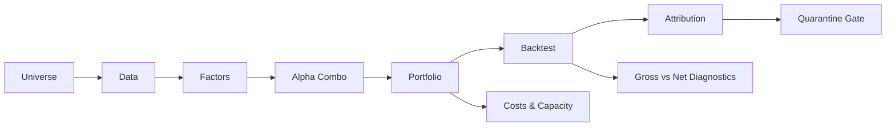

# Multi-Factor Alpha Research & Risk Engineering Platform

[](requirements.txt)
[](#quick-start)
[](LICENSE)
[](results/v4_launch_go_no_go.json)

## TL;DR

This is an end-to-end US equity multi-factor research and risk-engineering
platform covering 2014 to 2024. It spans universe construction, data cleaning,
factor research, alpha combination, portfolio construction, T+1 backtesting,
risk attribution, acceptance gates, and launch-readiness controls.

The project is intentionally not positioned as a finished live alpha product.
Its contribution is a reproducible system that can separate gross signal from
implementation drag, block unsupported attribution claims, and show what must
be fixed before a strategy deserves production language.

For a short reviewer-oriented summary, see
[`docs/PROJECT_BRIEF.md`](docs/PROJECT_BRIEF.md). For a guided review path,
see [`docs/REVIEWER_GUIDE.md`](docs/REVIEWER_GUIDE.md).

## Version Map

| Track | Purpose | Status | Key Evidence |
| --- | --- | --- | --- |
| v1 research platform | Establish the full seven-pillar research pipeline and diagnose the first strategy result. | Research complete; weak net strategy by design. | `results/backtest/metrics.json`, `reports/pillar6_7_narrative_pivot.md` |
| v4 engineering candidate | Add turnover-aware construction, risk controls, acceptance gates, replay, and launch guardrails. | Engineering-ready locally; live launch blocked on real PB borrow feed. | `reports/v4_acceptance_gate.md`, `docs/v4_launch_handoff.md`, `results/v4_launch_go_no_go.json` |
| Public portfolio package | Present the project honestly for interview/review use. | In progress. | `docs/PROJECT_BRIEF.md`, `docs/career/` |

## Visual Overview



## Headline Results (Honest)

### v1 Research Result

| Metric | Value | Source |
| --- | ---: | --- |
| Net Sharpe | 0.39 | `results/backtest/metrics.json` |
| Gross Sharpe | 0.69 | gross price-return PnL diagnostic |
| Annual Return (net) | 4.54% | `results/backtest/metrics.json` |
| Max Drawdown | -26.19% | `results/backtest/metrics.json` |
| Annual Turnover | 85.6x/year | `results/backtest/metrics.json` |
| Implementation Drag | 0.46 | gross PnL minus net PnL |
| Pure Alpha (Barra-style attribution) | QUARANTINED | `reports/pillar6_7_attribution_quarantine.md` |

The v1 result is intentionally presented as a weak strategy with a strong
diagnostic trail. Net Sharpe is below the sanity range, turnover is too high,
and risk attribution is blocked until a real market-cap panel is restored. See
`reports/pillar6_7_narrative_pivot.md` for the decision record.

### v4 Engineering Candidate

| Metric / Gate | Value | Source |
| --- | ---: | --- |
| Acceptance gates | 17 PASS / 0 PARTIAL / 0 FAIL | `reports/v4_acceptance_gate.md` |
| Full-sample acceptance Sharpe | 1.05 | `reports/v4_acceptance_gate.md` |
| 2022 shock Sharpe | 1.14 | `reports/v4_acceptance_gate.md` |
| Launch go/no-go | BLOCKED | `results/v4_launch_go_no_go.json` |
| P0 blocker | PB borrow real feed | `reports/v4_live_readiness_checklist.md` |
| Time-split test windows | 6 / 6 positive Sharpe; weakest 2024 Sharpe 0.05 | `results/v4_walk_forward/walk_forward_report.md` |
| Parameter-selected walk-forward | 5 / 6 positive test Sharpe; weakest 2021 Sharpe -0.04 | `results/v4_walk_forward_selection_full/v4_walk_forward_selection_report.md` |
| Factor ablation | Dropping `week_52_high` improves no-cost combo Sharpe by 0.07 | `results/factor_ablation/factor_ablation_report.md` |

The v4 layer is a production-engineering candidate, not a live-readiness claim.
It demonstrates acceptance gates, risk controls, replay manifests, data
integrity checks, kill-switch procedures, and PB borrow-feed boundaries. The
current launch guard remains blocked until a real PB borrow feed is delivered,
validated, and passed through the dry-run evidence bundle.

## Key Findings

1. Implementation drag is the binding constraint. Gross PnL sums to 1.055,
   while net PnL sums to 0.595, so about 0.46 cumulative return points are lost
   in the portfolio construction and trading layer.
2. Attribution-driven self-criticism shows that factor exposure, not portfolio
   construction, drives the remaining return. The equal-market-cap smoke test
   indicates negative pure alpha after costs, so the value-add is not where v1
   initially expected it to be.
3. Fail-closed reporting prevented publishing a misleading Barra attribution.
   When market-cap data is missing, `scripts/run_attribution.py` refuses to run
   by default instead of silently falling back to equal weights.

## Architecture: 7 Pillars

| Pillar | Topic | Status |
| --- | --- | --- |
| 1 | Universe Construction | DONE |
| 2 | Data Engineering | DONE |
| 3 | Factor Library | DONE |
| 4 | Alpha Combination | DONE |
| 5 | Portfolio Construction | DONE |
| 6 | Backtest Engine | DONE (self-critical result) |
| 7 | Risk Model & Attribution | DONE (quarantined until market-cap data is restored) |

**Pillar 1: Universe Construction**  
Defines the US equity research universe and supporting metadata used throughout
the pipeline. The goal is a stable, reproducible investable universe rather
than an unexamined symbol list.

**Pillar 2: Data Engineering**  
Builds cleaned price, fundamentals, and classification inputs. The current
workspace has usable price data but an empty fundamentals file, which is why
Barra-style attribution is blocked.

**Pillar 3: Factor Library**  
Implements price, value, quality, low-volatility, and size factor modules with
point-in-time and look-ahead protections where the required data exists.

**Pillar 4: Alpha Combination**  
Combines the active price factors into candidate alpha scores and records
research-approved direction transforms separately from raw factor definitions.

**Pillar 5: Portfolio Construction**  
Transforms alpha scores into long-short weights with neutralization,
implementation, capacity, cost, and risk controls. v1's main weakness is that
this layer trades too aggressively and loses too much gross signal.

**Pillar 6: Backtest Engine**  
Runs a shifted T+1 vectorized backtest, writes net PnL/NAV/trade artifacts, and
reports the current weak-but-real net metrics.

**Pillar 7: Risk Model & Attribution**  
Implements Barra-style cross-sectional factor attribution and tearsheet
generation. It now fails closed without a positive market-cap panel, so the old
equal-fallback attribution is quarantined.

See `docs/architecture.md` for a more detailed narrative walkthrough.

## What This Project Demonstrates

- Research pipeline: universe -> data -> factors -> alpha -> portfolio ->
  backtest -> attribution.
- Engineering discipline: ADR-driven changes, PIT audit, source-of-truth cache
  reconciliation, kill switch runbook, and pre-launch acceptance gates.
- Attribution discipline: gross/net separation, Barra-style WLS design, and
  fail-closed reporting when required inputs are absent.
- Research honesty: quarantine documentation, narrative pivot record, and an
  explicit v2 plan instead of a fabricated hero metric.

Interview preparation notes are in `docs/interview_qa.md`.

## Roadmap (v2)

Priority order:

1. Restore a daily market-cap and fundamentals panel from real shares
   outstanding, adjusted prices, and point-in-time fundamental fields.
2. Rerun sqrt(market_cap) WLS attribution without equal-cap fallback.
3. Run walk-forward and out-of-sample validation so v4 is not judged only on an
   in-sample acceptance grid.
4. Promote the leave-one-out factor ablation into the V4 optimizer loop,
   especially reviewing `week_52_high`, which improves the no-cost combination
   Sharpe when removed.
5. Compare no-trade bands, turnover penalties, and softer neutralization against
   gross-signal preservation and net implementation drag.
6. Test regime-aware factor weighting, especially around low-volatility,
   reversal, and 52-week-high exposure.
7. Wire a real PB borrow feed, rerun the PB-gated dry run, and require a
   `READY` launch bundle before using live-readiness language.

## Quick Start

Create an environment and install the public-repo dependencies:

```powershell
python -m venv .venv
.\.venv\Scripts\Activate.ps1
python -m pip install -r requirements.txt
```

Use the existing local artifacts to reproduce the v1 backtest:

```powershell
python scripts\run_backtest.py --weights results\pillar5_artifacts\v3_weights.parquet --prices data\processed\prices.parquet --output results\backtest
```

The attribution command is expected to fail closed in the current workspace
unless `data/processed/daily_fundamentals.parquet` contains a valid positive
`market_cap` panel and `data/processed/daily_fundamentals_contract.json`
reports a passing contract:

```powershell
python scripts\run_attribution.py
```

Expected failure:

```text
ValueError: No usable market_cap panel found. Barra-style attribution requires positive market caps for sqrt(market_cap) WLS weights.
```

To rebuild the daily market-cap panel after restoring real shares outstanding:

```powershell
python scripts\build_market_cap_panel.py --fundamentals data\processed\fundamentals.parquet --prices data\processed\prices.parquet --output data\processed\daily_fundamentals.parquet --report data\processed\daily_fundamentals_contract.json --input-format long --lag-days 45
```

For the external fundamentals CSV import workflow, see
`docs/fundamentals_ingestion_guide.md`.

For a smoke test only, the old equal-market-cap path can be run explicitly into
a separate folder:

```powershell
python scripts\run_attribution.py --allow-equal-market-cap-fallback --output results\strategy_reports_smoke
```

Run the focused validation suite:

```powershell
python -m pytest tests/test_attribution.py tests/test_run_attribution_market_caps.py tests/test_backtest_pnl.py tests/test_run_backtest_smoke.py tests/test_tearsheet_smoke.py tests/test_risk_model.py
```

Generate a time-split validation report for the v4 replay return stream:

```powershell
python scripts\run_walk_forward_validation.py --returns results\v4_e1_replay\v4_returns_panel.parquet --return-column daily_return_bps --output results\v4_walk_forward --train-years 5 --test-years 1
```

This is a rolling train/test time-split diagnostic for an already-built return
stream. It is useful for detecting full-sample dependence, but it should not be
described as a full retraining walk-forward study.

Generate a parameter-selection walk-forward report for the v4 replay scaffold:

```powershell
python scripts\run_v4_walk_forward_selection.py --v3-cache-dir results\pillar5_artifacts --output results\v4_walk_forward_selection_full --train-years 5 --test-years 1
```

This selects v4 parameters on each train window and evaluates only the selected
configuration on the next test year. It is stronger than a fixed return-stream
split, but it is still replay-scaffold evidence rather than live alpha proof.

Run the Pillar 4 leave-one-out factor ablation:

```powershell
python scripts\run_factor_ablation.py --config config\pillar4_candidate_factors.yaml --portfolio baseline_4f_equal_weight --output results\factor_ablation
```

This is a no-cost combination-layer diagnostic. In the current run, dropping
`week_52_high` improves Sharpe from 0.77 to 0.84, so that factor should be
reviewed before promotion into a stronger v2/V4 research loop.

For public release, large binary panels and generated images are intentionally
excluded from normal Git tracking. See `docs/data_policy.md` for the data and
artifact strategy.

## Tech Stack

Python 3.x, pandas, numpy, cvxpy (optional), statsmodels, matplotlib, pytest.

## Extended: Production Engineering Layer

This project also includes a production-grade risk engineering scaffold built
on top of Pillar 5 portfolio construction. It demonstrates:

- ADR-driven design change control (3 ADRs)
- Point-in-time data audit framework
- Source-of-truth cache reconciliation
- Pre-launch acceptance gates
- Operator runbooks, including kill switch and PB borrow feed contracts

See `docs/extended/README.md` for details. This layer is supplementary to the
core strategy pipeline.

## Repository Layout

```text
.
|-- config/              # Research and pipeline configuration
|-- data/                # Local data workspace
|-- docs/                # Project documentation
|   |-- adr/             # Architecture decision records
|   `-- extended/        # Supplementary production-engineering layer
|-- reports/             # Generated research and engineering reports
|-- results/             # Generated artifacts and outputs
|-- scripts/             # Reproducible command-line workflows
|-- src/                 # Core strategy implementation
|   |-- backtest/        # Pillar 6 T+1 backtest engine
|   |-- combination/     # Pillar 4 alpha combination
|   |-- data/            # Pillars 1-2 universe and data modules
|   |-- factors/         # Pillar 3 factor library
|   |-- portfolio/       # Pillar 5 portfolio construction and risk controls
|   |-- reporting/       # Tearsheet and reporting utilities
|   |-- research/        # Factor research diagnostics
|   `-- risk/            # Pillar 7 risk model and attribution
`-- tests/               # Automated tests
```
