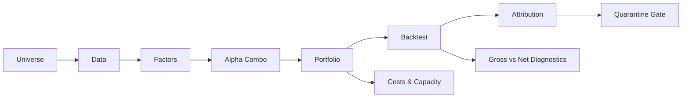

# Multi-Factor Alpha Equity Strategy (US, 2014-2024)

[](requirements.txt)
[](#quick-start)
[](LICENSE)
[](results/v4_launch_go_no_go.json)

## TL;DR

This project is a complete research pipeline for a multi-factor US equity
strategy from 2014 to 2024, built end to end from universe construction to
risk attribution. The headline contribution is not a high-Sharpe number, but a
fully reproducible pipeline with gross/net attribution, fail-closed reporting,
and explicit self-criticism through quarantine documentation.

## Visual Overview



## Headline Results (Honest)

| Metric | Value | Source |
| --- | ---: | --- |
| Net Sharpe | 0.39 | `results/backtest/metrics.json` |
| Gross Sharpe | 0.69 | gross price-return PnL diagnostic |
| Annual Return (net) | 4.54% | `results/backtest/metrics.json` |
| Max Drawdown | -26.19% | `results/backtest/metrics.json` |
| Annual Turnover | 85.6x/year | `results/backtest/metrics.json` |
| Implementation Drag | 0.46 | gross PnL minus net PnL |
| Pure Alpha (Barra-style attribution) | QUARANTINED | `reports/pillar6_7_attribution_quarantine.md` |

The v1 result is intentionally presented as a weak strategy with a strong
diagnostic trail. The net Sharpe is below the sanity range, turnover is too
high, and the risk attribution is blocked until a real market-cap panel is
restored. See `reports/pillar6_7_narrative_pivot.md` for the decision record.

## Key Findings

1. Implementation drag is the binding constraint. Gross PnL sums to 1.055,
   while net PnL sums to 0.595, so about 0.46 cumulative return points are lost
   in the portfolio construction and trading layer.
2. Attribution-driven self-criticism shows that factor exposure, not portfolio
   construction, drives the remaining return. The equal-market-cap smoke test
   indicates negative pure alpha after costs, so the value-add is not where v1
   initially expected it to be.
3. Fail-closed reporting prevented publishing a misleading Barra attribution.
   When market-cap data is missing, `scripts/run_attribution.py` refuses to run
   by default instead of silently falling back to equal weights.

## Architecture: 7 Pillars

| Pillar | Topic | Status |
| --- | --- | --- |
| 1 | Universe Construction | DONE |
| 2 | Data Engineering | DONE |
| 3 | Factor Library | DONE |
| 4 | Alpha Combination | DONE |
| 5 | Portfolio Construction | DONE |
| 6 | Backtest Engine | DONE (self-critical result) |
| 7 | Risk Model & Attribution | DONE (quarantined until market-cap data is restored) |

**Pillar 1: Universe Construction**  
Defines the US equity research universe and supporting metadata used throughout
the pipeline. The goal is a stable, reproducible investable universe rather
than an unexamined symbol list.

**Pillar 2: Data Engineering**  
Builds cleaned price, fundamentals, and classification inputs. The current
workspace has usable price data but an empty fundamentals file, which is why
Barra-style attribution is blocked.

**Pillar 3: Factor Library**  
Implements price, value, quality, low-volatility, and size factor modules with
point-in-time and look-ahead protections where the required data exists.

**Pillar 4: Alpha Combination**  
Combines the active price factors into candidate alpha scores and records
research-approved direction transforms separately from raw factor definitions.

**Pillar 5: Portfolio Construction**  
Transforms alpha scores into long-short weights with neutralization,
implementation, capacity, cost, and risk controls. v1's main weakness is that
this layer trades too aggressively and loses too much gross signal.

**Pillar 6: Backtest Engine**  
Runs a shifted T+1 vectorized backtest, writes net PnL/NAV/trade artifacts, and
reports the current weak-but-real net metrics.

**Pillar 7: Risk Model & Attribution**  
Implements Barra-style cross-sectional factor attribution and tearsheet
generation. It now fails closed without a positive market-cap panel, so the old
equal-fallback attribution is quarantined.

See `docs/architecture.md` for a more detailed narrative walkthrough.

## What This Project Demonstrates

- Research pipeline: universe -> data -> factors -> alpha -> portfolio ->
  backtest -> attribution.
- Engineering discipline: ADR-driven changes, PIT audit, source-of-truth cache
  reconciliation, kill switch runbook, and pre-launch acceptance gates.
- Attribution discipline: gross/net separation, Barra-style WLS design, and
  fail-closed reporting when required inputs are absent.
- Research honesty: quarantine documentation, narrative pivot record, and an
  explicit v2 plan instead of a fabricated hero metric.

Interview preparation notes are in `docs/interview_qa.md`.

## Roadmap (v2)

- Restore a daily market-cap panel from real shares outstanding and adjusted
  prices, then rerun sqrt(market_cap) WLS attribution without fallback.
- Run leave-one-out factor ablations across the six price factors to identify
  value-destroying inputs.
- Reduce Pillar 5 neutralization intensity with no-trade bands and turnover
  penalties to reclaim implementation drag.
- Test regime-aware factor weighting, especially around low-volatility and
  52-week-high exposure.
- Reassess sector rotation and realized beta drift after the neutralization
  changes.

## Quick Start

Create an environment and install the public-repo dependencies:

```powershell
python -m venv .venv
.\.venv\Scripts\Activate.ps1
python -m pip install -r requirements.txt
```

Use the existing local artifacts to reproduce the v1 backtest:

```powershell
python scripts\run_backtest.py --weights results\pillar5_artifacts\v3_weights.parquet --prices data\processed\prices.parquet --output results\backtest
```

The attribution command is expected to fail closed in the current workspace
because `data/processed/fundamentals.parquet` does not contain market caps:

```powershell
python scripts\run_attribution.py
```

Expected failure:

```text
ValueError: No usable market_cap panel found. Barra-style attribution requires positive market caps for sqrt(market_cap) WLS weights.
```

For a smoke test only, the old equal-market-cap path can be run explicitly into
a separate folder:

```powershell
python scripts\run_attribution.py --allow-equal-market-cap-fallback --output results\strategy_reports_smoke
```

Run the focused validation suite:

```powershell
python -m pytest tests/test_attribution.py tests/test_run_attribution_market_caps.py tests/test_backtest_pnl.py tests/test_run_backtest_smoke.py tests/test_tearsheet_smoke.py tests/test_risk_model.py
```

For public release, large binary panels and generated images are intentionally
excluded from normal Git tracking. See `docs/data_policy.md` for the data and
artifact strategy.

## Tech Stack

Python 3.x, pandas, numpy, cvxpy (optional), statsmodels, matplotlib, pytest.

## Extended: Production Engineering Layer

This project also includes a production-grade risk engineering scaffold built
on top of Pillar 5 portfolio construction. It demonstrates:

- ADR-driven design change control (3 ADRs)
- Point-in-time data audit framework
- Source-of-truth cache reconciliation
- Pre-launch acceptance gates
- Operator runbooks, including kill switch and PB borrow feed contracts

See `docs/extended/README.md` for details. This layer is supplementary to the
core strategy pipeline.

## Repository Layout

```text
.
|-- config/              # Research and pipeline configuration
|-- data/                # Local data workspace
|-- docs/                # Project documentation
|   |-- adr/             # Architecture decision records
|   `-- extended/        # Supplementary production-engineering layer
|-- reports/             # Generated research and engineering reports
|-- results/             # Generated artifacts and outputs
|-- scripts/             # Reproducible command-line workflows
|-- src/                 # Core strategy implementation
|   |-- backtest/        # Pillar 6 T+1 backtest engine
|   |-- combination/     # Pillar 4 alpha combination
|   |-- data/            # Pillars 1-2 universe and data modules
|   |-- factors/         # Pillar 3 factor library
|   |-- portfolio/       # Pillar 5 portfolio construction and risk controls
|   |-- reporting/       # Tearsheet and reporting utilities
|   |-- research/        # Factor research diagnostics
|   `-- risk/            # Pillar 7 risk model and attribution
`-- tests/               # Automated tests
```
